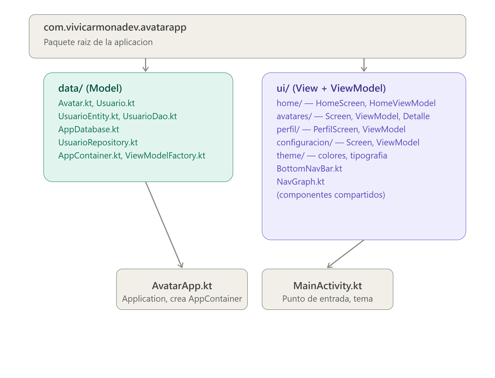
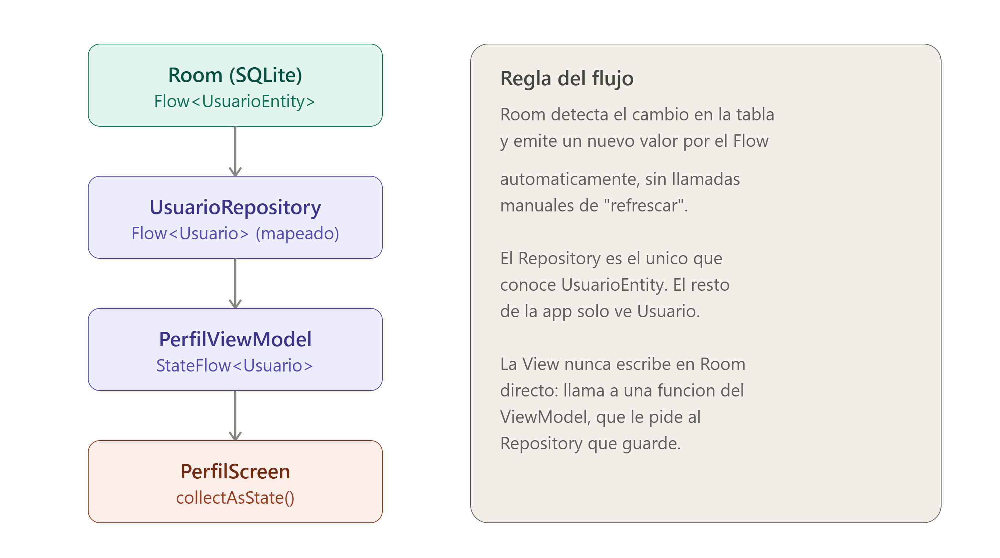

# Arquitectura MVVM

La app sigue el patrón **Model-View-ViewModel (MVVM)**, la arquitectura recomendada por Google para apps Android modernas con Jetpack Compose.

## Estructura de carpetas

## Las 3 capas

### Model (`data/`)
Contiene las estructuras de datos puras (`Avatar`, `Usuario`), las entidades de base de datos (`UsuarioEntity`), el acceso a Room (`UsuarioDao`, `AppDatabase`), y el `Repository` — la única puerta de entrada a los datos.

### ViewModel
Cada pantalla tiene su propio ViewModel. Reglas que se respetan en todo el proyecto:
- Nunca importa nada de `androidx.compose.*`
- Expone el estado como `StateFlow`, nunca mutable hacia afuera
- Contiene toda la lógica de negocio de esa pantalla

### View (`Screen.kt`, Composables)
Solo dibuja lo que el ViewModel le da, y notifica acciones del usuario mediante callbacks (`onClick`, etc.). No decide nada por sí sola.

## Inyección de dependencias (manual)

El proyecto no usa Hilt/Koin — se implementó un contenedor manual simple:

- **`AppContainer`**: crea y mantiene una única instancia del `AppDatabase` y el `UsuarioRepository`
- **`AvatarApp`** (Application): crea el `AppContainer` una sola vez al iniciar la app
- **`ViewModelFactory`**: permite crear ViewModels que reciben el `Repository` en su constructor (necesario porque `viewModel()` de Compose no soporta parámetros por defecto)

## Flujo de datos (ejemplo: Perfil)

Cualquier cambio en la base de datos se refleja automáticamente en la UI, sin necesidad de "refrescar" manualmente.